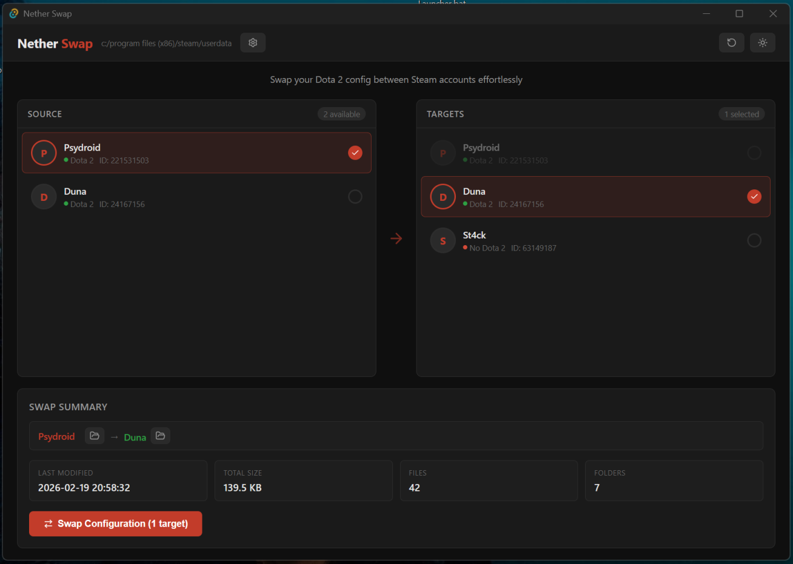

# Nether Swap

**Nether Swap** is a Steam helper application that lets you effortlessly swap game configuration (hotkeys, settings, and more) between Steam profiles.

<p align="center">
  
</p>

---

## Download

Pre-built binaries are available on the [GitHub Releases](https://github.com/naghim/nether-swap/releases) page for:

| Platform    | Notes                      |
| ----------- | -------------------------- |
| **Windows** | x86-64 installer           |
| **Linux**   | `.deb` / `.rpm` / AppImage |
| **macOS**   | Apple Silicon `.dmg`       |

Download the appropriate binary for your platform, install it, and you're ready to go — no additional runtime or dependencies required.

---

## Features

- **Auto-detects Steam** — Nether Swap automatically finds your Steam installation on Windows, Linux, and macOS. You can also point it to a custom path manually.
- **Profile discovery** — Lists all Steam accounts present in the `userdata` directory, showing which ones have game configuration data.
- **Multi-game support** — Browse and select which games' configuration data to swap, with game names automatically resolved from Steam's app manifests.
- **One-to-many swapping** — Select a source profile and push game configs to one or more target profiles at once.
- **Automatic backups** — Before overwriting any profile, the existing game config is safely backed up to a `dunabackups` folder. Backed-up profiles also appear as sources so you can restore them later.
- **Swap preview** — See a summary (file count, folder count, total size, and last modified time) before committing to a swap.
- **Dark & light theme** — Choose the look that suits you.
- **Cross-platform** — Runs natively on Windows, Linux, and macOS.

---

## How It Works

Nether Swap reads Steam's `userdata` directory, which contains one folder per Steam account. Each account folder may contain numbered subdirectories corresponding to game IDs — these hold game-specific configuration data (hotkeys, settings, and more).

Games are identified by matching folders against Steam's `appmanifest_<id>.acf` files in all configured Steam library directories, ensuring only installed games with recognized names appear in the selection list.

When you perform a swap:

1. You select a **source profile**, pick the **games** you want to copy, and choose one or more **target profiles**.
2. Each target profile's existing game folders are **backed up** to `userdata/dunabackups/<account_id>/<game_id>`.
3. The target's game folders are replaced with an exact copy from the source profile.

Backups are non-destructive and show up in the profile list so you can always revert.

---

## Building from Source

Nether Swap is built with [Tauri 2](https://tauri.app) (Rust backend) and [React](https://react.dev) / TypeScript (frontend).

### Prerequisites

- [Rust](https://rustup.rs) (stable toolchain)
- [Node.js](https://nodejs.org) (v18+) or [Bun](https://bun.sh)

**Linux only** — install the required system libraries:

```bash
sudo apt-get update
sudo apt-get install -y \
  libgtk-3-dev \
  libwebkit2gtk-4.1-dev \
  libappindicator3-dev \
  librsvg2-dev \
  patchelf
```

### Clone & run in development mode

```bash
git clone https://github.com/naghim/nether-swap.git
cd nether-swap

# Install frontend dependencies
npm install    # or: bun install

# Start the app in dev mode (hot-reloading)
npm run tauri dev    # or: bun run tauri dev
```

### Build a release binary

```bash
npm run tauri build    # or: bun run tauri build
```

The compiled application and installer will be placed in `src-tauri/target/release/bundle/`.

---
